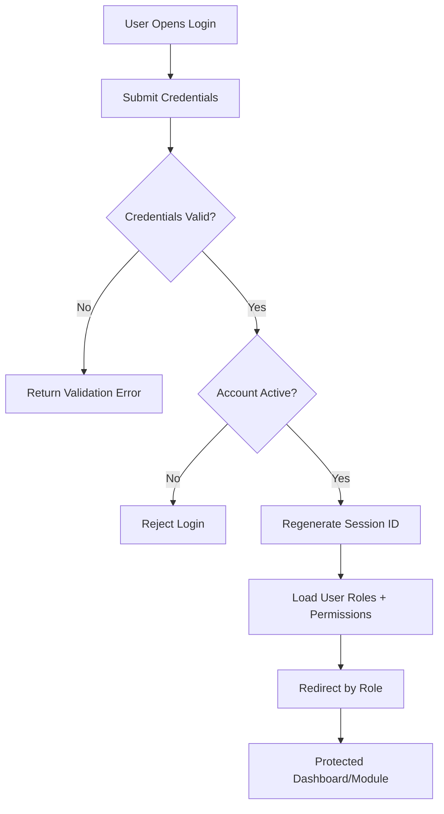

# InventoryV2 Pharmacy System - Foundation + Auth/RBAC Module Architecture

## Module Overview
The Foundation + Auth/RBAC Module is the first implementation block of the InventoryV2 Pharmacy System. It provides secure authentication, role-based authorization, protected routing, and admin bootstrap capabilities used by all downstream modules.

## Objectives
- Implement secure login, signup, and logout flows
- Enforce role-based access for `admin`, `employee`, and `IT dev/staff`
- Keep controllers lean by delegating to services and repositories
- Establish baseline middleware/filters and audit logging hooks
- Provide test coverage for auth and role protection behaviors

## Scope

### Included
- Account registration and login forms
- Password hashing and session management
- Role assignment and permission mapping
- Role-protected routes and controller guards
- Admin dashboard route skeleton
- Unit and integration tests for auth/rbac

### Excluded
- Procurement workflow operations
- Receiving, stock posting, and issuance flows
- Advanced external identity integrations (SSO/OAuth)

---

## Module Architecture

### Backend Flow
`AuthController -> AuthService -> AuthRepository -> UserModel -> MySQL`

`RoleController/Admin Setup -> RoleService -> RoleRepository -> Role/Permission Models -> MySQL`

### Key Components
- **Controllers**: `AuthController`, `SignupController`, `Admin/UserController`
- **Services**: `AuthenticationService`, `AuthorizationService`
- **Repositories**: `UserRepository`, `RoleRepository`, `PermissionRepository`
- **Filters**: `AuthFilter`, `RoleFilter`
- **Views**: `auth/login.php`, `auth/signup.php`, `admin/dashboard.php`

---

## Folder Structure (Module-Specific)
```text
app/
├── Controllers/
│   ├── Auth/
│   │   ├── LoginController.php
│   │   ├── SignupController.php
│   │   └── LogoutController.php
│   └── Admin/
│       └── DashboardController.php
├── Services/
│   └── Auth/
│       ├── AuthenticationService.php
│       ├── RegistrationService.php
│       └── AuthorizationService.php
├── Repositories/
│   ├── Contracts/Auth/
│   │   ├── UserRepositoryInterface.php
│   │   ├── RoleRepositoryInterface.php
│   │   └── PermissionRepositoryInterface.php
│   └── EloquentLike/Auth/
│       ├── UserRepository.php
│       ├── RoleRepository.php
│       └── PermissionRepository.php
├── Filters/
│   ├── AuthFilter.php
│   └── RoleFilter.php
└── Views/
    ├── auth/
    │   ├── login.php
    │   └── signup.php
    └── admin/
        └── dashboard.php
```

---

## Database Entities

### Core Tables
- `users` - Credentials, profile, account status
- `roles` - Role definitions
- `permissions` - Granular access controls
- `user_roles` - User-role link table
- `role_permissions` - Role-permission link table
- `audit_logs` - Security and access event history

### Required Seed Data
- Roles: `admin`, `employee`, `IT dev/staff`
- Permissions:
  - **Admin & User Management**
    - `auth.manage_users` - Manage user roles and assignments
    - `auth.support_users` - Reset passwords and unlock accounts
    - `dashboard.view_admin` - Access admin dashboard
  - **Procurement Operations**
    - `procurement.pr.create` - Create purchase requests
    - `procurement.pr.approve` - Approve/reject purchase requests
    - `procurement.po.create` - Generate purchase orders
    - `procurement.por.manage` - Manage PO request transitions
    - `procurement.view` - View purchase requests and orders
  - **Receiving Operations**
    - `receiving.convert` - Convert PO requests to receiving
    - `receiving.view` - View receiving records
  - **Inventory Operations**
    - `inventory.quantity.update` - Post receiving to inventory
    - `inventory.issuance.create` - Create and submit issuances
    - `inventory.issuance.approve` - Approve/reject/release issuances
  - **Reporting & Support**
    - `reports.view` - View inventory and movement reports
    - `audit.view` - View workflow and audit logs
    - `workflow.cancel_draft` - Cancel draft records
    - `system.diagnostics` - System health and diagnostics

---

## Authentication Workflow



### Signup Workflow
1. User submits signup form
2. `RegistrationService` validates input and uniqueness checks
3. Password is hashed with `password_hash()`
4. User record is created with default role assignment
5. Session is initialized, and user is redirected per policy

---

## Authorization Strategy

### Route-Level Protection
- `AuthFilter` ensures authenticated session
- `RoleFilter` verifies user has required role/permission
- Unauthorized attempts return `403` and are logged

### Service-Level Protection
- Critical service methods enforce permission checks before writes
- Workflow operations fail fast with domain authorization exceptions
- Audit logs include actor, action, module, and reference metadata

### Controller Contract
- Controllers do not contain business rules
- Controllers only:
  - Validate request payload
  - Call service methods
  - Return view or redirect response

---

## Route Plan

### Public Routes
- `GET /login`
- `POST /login`
- `GET /signup`
- `POST /signup`

### Protected Routes
- `POST /logout`
- `GET /admin/dashboard` (`admin` only)
- `GET /admin/users` (`auth.manage_users`)
- `POST /admin/users/{id}/role` (`auth.manage_users`)

### Future Route Gate Reuse
The same `AuthFilter` and `RoleFilter` structure is reused in:
- Procurement routes
- Receiving routes
- Inventory/Issuance routes
- Reporting routes

---

## Validation Rules

### Signup
- `username`: required, alphanumeric, min/max length, unique
- `email`: required, valid email, unique
- `password`: required, min length, complexity rules
- `display_name`: required

### Login
- `username_or_email`: required
- `password`: required

### Role Assignment
- `user_id`: required, exists
- `role_id`: required, exists

---

## Security Controls

### Authentication Security
- Password hash storage only (never plaintext)
- Session ID regeneration on successful login
- Session invalidation and regeneration on logout
- Login throttling/rate limiting recommended

### Request Security
- CSRF protection enabled globally
- Input validation on all auth/admin forms
- Output escaping in views
- No sensitive data in query strings

### Audit Controls
- Log login success/failure attempts
- Log role assignment changes
- Log user status changes (active/inactive/suspended)
- Log unauthorized access attempts

---

## Testing Strategy

### Unit Tests
- `AuthenticationService` credential and status checks
- `RegistrationService` validation and uniqueness handling
- `AuthorizationService` permission resolution logic
- Repository method contracts for users/roles/permissions

### Integration Tests
- Login success and failure scenarios
- Signup flow and default role assignment
- Protected route access by role
- Unauthorized route denial and redirect behavior

### Security Tests
- CSRF form enforcement checks
- Session regeneration assertions
- Password hash verification behavior

---

## Implementation Checklist

### Phase A1: Setup
- [x] Install/publish Shield auth migrations and run setup
- [x] Seed baseline groups and permissions (`admin`, `employee`, `it_staff`)
- [x] Register repository/service bindings (`RepositoryServices`)

### Phase A2: Auth Flows
- [x] Implement login controller/service/repository
- [x] Implement signup controller/service/repository
- [x] Implement logout and session invalidation

### Phase A3: RBAC
- [x] Build role and permission resolution service
- [x] Implement role filter and route integration
- [x] Add admin dashboard access gate

### Phase A4: Tests
- [x] Add unit tests for auth services
- [x] Add integration tests for auth/rbac routes
- [x] Validate failure paths and status handling

---

## Definition of Done
- Login/signup/logout work with secure session handling
- `admin`, `employee`, and `IT dev/staff` roles are seeded and assignable
- Route-level role protection is active
- Admin dashboard is reachable by authorized users only
- Auth/RBAC tests pass in unit and integration suites

---

**Document Version:** 1.1  
**Last Updated:** 2026-02-20  
**Related Documents:**
- [Architectural Plan](Architectural Plan.md)
- [Architecture Reference](Architecture.md)
- [Complete Database Schema](PHARMACY_DATABASE_SCHEMA.md)

