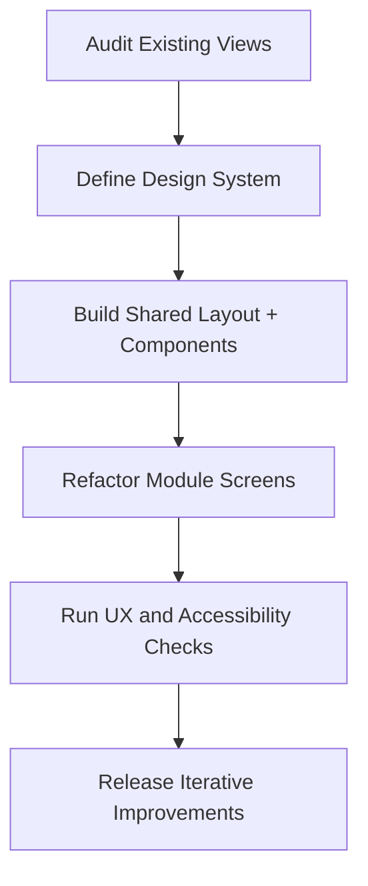
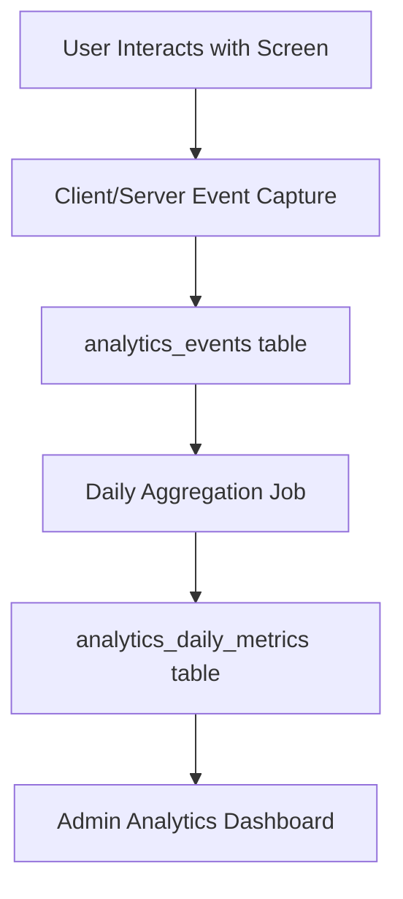

# InventoryV2 Pharmacy System - Frontend Design + Analytics Architecture

## Module Overview
The Frontend Design + Analytics Module upgrades the current functional HTML views into a consistent, scalable UI system and introduces internal analytics for usage, workflow friction, and reporting behavior.

## Objectives
- Standardize UI/UX across auth, procurement, receiving, inventory, and reporting pages
- Build reusable layout and component patterns for faster page development
- Improve form usability, accessibility, and error clarity
- Add privacy-safe analytics for workflow actions and page usage
- Keep compatibility with current server-rendered CodeIgniter architecture

## Scope

### Included
- Design system foundation (tokens, typography, spacing, components)
- Shared layout shells (top nav, side nav, content regions, alerts)
- Standard form/table/page templates for all modules
- Frontend interaction patterns (filters, status badges, confirmations)
- Internal analytics event tracking and analytics dashboard/reporting endpoints

### Excluded
- Full SPA migration (React/Vue) in this phase
- Third-party cloud analytics by default (Google Analytics, Mixpanel)
- Public marketing site redesign

---

## Workflow Design

### UI Standardization Flow
`Audit Current Views -> Define Design Tokens -> Build Shared Components -> Refactor Module Screens -> Validate UX + Accessibility`



### Analytics Flow
`User Action -> Event Capture -> Event Storage -> Daily Aggregation -> Dashboard + Reports`



---

## Module Architecture

### Frontend Layer Flow
`Route -> Controller -> ViewModel Data -> Shared Layout -> Page Components -> User`

### Analytics Layer Flow
`Controller/JS Tracker -> AnalyticsService -> AnalyticsRepository -> MySQL`

### Key Components
- **Views and Layouts**
  - `layouts/main_layout.php`
  - `layouts/auth_layout.php`
  - shared topbar/sidebar/flash components
- **Style System**
  - design tokens (`colors`, `spacing`, `radius`, `shadows`, `status colors`)
  - shared component styles for forms, tables, cards, badges, modals
- **Interaction Scripts**
  - filter persistence, inline validation helpers, confirmation modals
  - optional progressive enhancement (no JS hard dependency)
- **Analytics Components**
  - `AnalyticsService`
  - `AnalyticsRepository`
  - `AnalyticsController` (admin/it_staff)
  - analytics middleware/helper for event recording

---

## Folder Structure (Frontend + Analytics)
```text
app/
├── Controllers/
│   └── Analytics/
│       └── AnalyticsController.php
├── Services/
│   └── Analytics/
│       └── AnalyticsService.php
├── Repositories/
│   ├── Contracts/Analytics/
│   │   └── AnalyticsRepositoryInterface.php
│   └── EloquentLike/Analytics/
│       └── AnalyticsRepository.php
├── Views/
│   ├── layouts/
│   │   ├── main_layout.php
│   │   └── auth_layout.php
│   ├── components/shared/
│   │   ├── alerts.php
│   │   ├── breadcrumbs.php
│   │   ├── table_status_badge.php
│   │   └── confirm_modal.php
│   └── analytics/
│       ├── dashboard.php
│       └── events.php
└── Database/
    └── Migrations/
        ├── CreateAnalyticsEventsTable.php
        └── CreateAnalyticsDailyMetricsTable.php

public/
└── assets/
    ├── css/
    │   ├── tokens.css
    │   ├── components.css
    │   └── pages/
    │       ├── auth.css
    │       ├── procurement.css
    │       ├── receiving.css
    │       ├── inventory.css
    │       └── reports.css
    └── js/
        ├── ui.js
        └── analytics.js
```

---

## Design System Specification

### Visual Foundation
- Typography scale: clear heading/body hierarchy
- Spacing scale: `4/8/12/16/24/32`
- Color tokens: brand, neutral, success, warning, danger, info
- Consistent status badges for workflow states (`draft`, `submitted`, `approved`, etc.)

### Core Components
- Page header with title + action buttons
- Card container for forms and summaries
- Standard data table with filter row and empty states
- Form field group with inline help and validation state
- Alert components for `success/error/warning/info`
- Confirmation modal for destructive actions

### Accessibility Baseline
- Keyboard navigable actions and forms
- WCAG color contrast for text/status indicators
- Proper labels, field descriptions, and error references
- Focus state visibility for all interactive elements

### Responsive Baseline
- Desktop-first admin table layout with mobile fallback
- Breakpoints: `>=1200`, `>=992`, `>=768`, `<768`
- Critical forms remain usable on tablet/mobile widths

---

## Analytics Architecture (Yes, Possible)

### Recommended Approach for This Project
Use **first-party on-prem analytics** stored in MySQL, integrated directly with CodeIgniter services.

Why this fits:
- No external data sharing (internal LAN/intranet system)
- Full control over data retention and schema
- Can correlate analytics with existing workflow entities (issuances, approvals, reports)
- Works with server-rendered pages and role-protected routes

### Analytics Data Model

#### `analytics_events`
- `id`
- `event_name` (e.g., `issuance.submitted`, `report.viewed`)
- `module` (`auth`, `procurement`, `receiving`, `inventory`, `reports`)
- `actor_id` (nullable)
- `reference_type` (nullable)
- `reference_id` (nullable)
- `route`
- `method`
- `ip_address`
- `user_agent`
- `metadata_json`
- `created_at`

#### `analytics_daily_metrics`
- `id`
- `metric_date`
- `metric_key` (e.g., `report.stock_balance.views`)
- `metric_value`
- `module`
- `dimension_json` (optional)
- `created_at`

### Initial Event Taxonomy
- **Auth**: login success/fail, logout
- **Procurement**: PR create/submit/approve/reject, PO create/issue
- **Receiving**: draft create, validate, post, void
- **Issuance**: create, submit, approve, release, release_failed
- **Reports**: page viewed + filter applied

### Analytics Consumption
- Admin analytics dashboard (`/analytics/dashboard`)
- Exportable operational usage report (`/analytics/events`)
- Weekly summary job for top actions and slow pages

---

## Route Plan

### Frontend Standardization Targets
- Existing routes retained; views are refactored to shared layouts/components
- Add optional UI helper routes only when needed (e.g., partial filter rendering)

### Analytics Routes
- `GET /analytics/dashboard` (admin,it_staff)
- `GET /analytics/events` (admin,it_staff)
- `GET /analytics/metrics` (admin,it_staff)
- `POST /analytics/track` (auth users; optional client-side endpoint)

---

## Security & Privacy
- Treat analytics as internal operational telemetry
- Do not store passwords, full PII payloads, or sensitive free text in metadata
- Hash or truncate IP if required by internal policy
- Role-restrict analytics viewing to `admin` and approved `it_staff`
- Retention policy recommendation: raw events 90-180 days, aggregated metrics 1-2 years

---

## Performance Strategy
- Insert analytics asynchronously where possible (queue-ready design)
- Batch aggregate metrics daily/hourly instead of heavy ad hoc scans
- Index `analytics_events` on `created_at`, `event_name`, `module`, `actor_id`
- Cache analytics dashboard summaries for short TTL windows

---

## Testing Strategy

### UI/UX Tests
- View integration tests for major forms/tables
- Route-to-view regression checks for shared layout adoption
- Accessibility spot checks (tab navigation, label association)

### Analytics Tests
- Unit tests for analytics service event recording
- Integration tests for event write on key workflows
- Metrics aggregation job tests (daily counters)
- Permission tests for analytics dashboard access

---

## Implementation Checklist

### Phase F1: Frontend Foundation
- [x] Define design tokens and base stylesheet
- [x] Implement shared main/auth layout templates
- [x] Implement core reusable components (alerts, badges, table shell, form shell)

### Phase F2: Screen Refactor
- [x] Refactor auth screens to shared layout/styles
- [x] Refactor procurement views (PR/approval/PO/PO request)
- [x] Refactor receiving and issuance views
- [x] Refactor report pages for consistency and usability

### Phase F3: Analytics Core
- [x] Add analytics migrations (`analytics_events`, `analytics_daily_metrics`)
- [x] Implement analytics repository/service/controller
- [x] Add server-side tracking for critical workflow actions
- [x] Add report-view tracking hooks

### Phase F4: Analytics Dashboard + Hardening
- [x] Build analytics dashboard and event list pages
- [x] Add daily aggregation command/job
- [x] Add analytics tests (unit + integration)
- [x] Finalize retention and privacy masking rules

---

## Definition of Done
- Frontend has a consistent design system applied across modules
- Shared layout/components reduce duplicated view code
- Forms/tables/messages behave consistently and accessibly
- Internal analytics events are captured for key workflows
- Admin analytics dashboard shows usable operational insights
- All related tests pass and role restrictions are enforced

---

**Document Version:** 1.1  
**Last Updated:** 2026-02-20  
**Related Documents:**
- [Architectural Plan](Architectural Plan.md)
- [Architecture Reference](Architecture.md)
- [Issuance + Reporting Module](ISSUANCE_REPORTING_MODULE_ARCHITECTURE.md)
- [Complete Database Schema](PHARMACY_DATABASE_SCHEMA.md)


## Phase F4 Implementation Notes
- Added Spark commands: `php spark analytics:aggregate` and `php spark analytics:prune`
- Added retention/privacy config: `app/Config/Analytics.php`
- Added analytics metrics page: `/analytics/metrics`
- Added test coverage for route guards, tracking, and analytics service aggregation/pruning behavior
