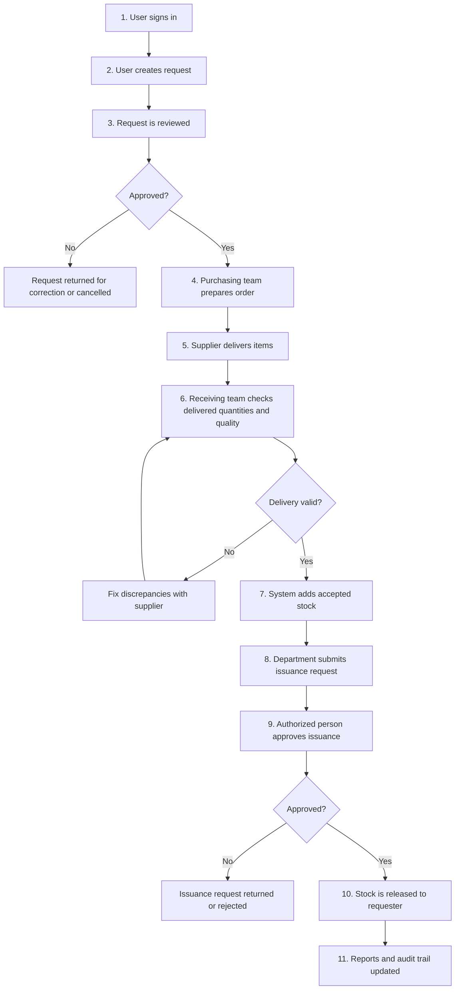

# InventoryV2 Pharmacy System - Complete Workflow (Non-Technical Guide)

## Purpose of This Document
This guide explains how the whole pharmacy system works in everyday language.
It is designed for managers, staff, and stakeholders who need to understand the process without technical terms.

---

## 1) Big Picture: How the Entire Process Works

### What this means
- The system starts when someone logs in and asks for items.
- Every critical action needs approval before moving forward.
- Stock only changes after proper receiving (incoming) or issuance (outgoing).
- Every action is recorded for transparency and accountability.

---

## 2) People Involved and What They Usually Do

| Role | Main Responsibilities |
|------|------------------------|
| Admin | Oversees approvals, user access, receiving validation, issuance release, and reporting |
| Employee | Creates purchase requests, tracks status, and requests item issuance |
| IT Dev/Staff | Supports user access issues, system checks, logs, and controlled operational support |

### Simple role summary
- **Admin:** Final control and oversight.
- **Employee:** Request and follow-up.
- **IT Dev/Staff:** Keep the system stable and support operations.

---

## 3) Step-by-Step Process (Plain Language)

## Step 1 - Sign In
**Goal:** Ensure only authorized users can access the system.
- User logs in (or signs up if new).
- System checks if account is active.
- User lands on the correct dashboard based on role.

**Why this matters:** Protects data and ensures the right people can do the right tasks.

---

## Step 2 - Create a Purchase Request
**Goal:** Request items that are needed by a department.
- Employee selects needed products and quantities.
- Employee submits the request.
- System marks status as pending for review.

**Why this matters:** Creates a formal and trackable request before any purchase happens.

---

## Step 3 - Review and Approval of Request
**Goal:** Confirm the request is valid and necessary.
- Admin reviews details (item, quantity, purpose).
- Admin can approve or reject.
- If rejected, request goes back for correction.

**Why this matters:** Prevents unnecessary or incorrect purchasing.

---

## Step 4 - Create and Issue Purchase Order
**Goal:** Formally order approved items from supplier.
- Purchasing/admin creates purchase order from approved request.
- Order is sent to supplier.
- Order status is tracked in the system.

**Why this matters:** Connects internal approval to actual supplier transaction.

---

## Step 5 - Receive Delivered Items
**Goal:** Confirm what arrived matches what was ordered.
- Receiving team encodes delivered items.
- They record accepted and rejected quantities.
- System checks if quantities are valid.

**Why this matters:** Stops wrong quantities or poor-quality items from entering stock.

---

## Step 6 - Post to Inventory
**Goal:** Update stock after valid receiving.
- Accepted items are added to inventory.
- Available balance is recalculated.
- An inbound movement record is created.

**Why this matters:** Keeps stock records accurate and traceable.

---

## Step 7 - Submit Issuance Request
**Goal:** Allow departments to request items from available stock.
- User selects needed items from inventory.
- Request is submitted for approval.
- Status is shown as pending until reviewed.

**Why this matters:** Ensures stock release follows controls, not informal requests.

---

## Step 8 - Approve and Release Issuance
**Goal:** Release items only after authorization.
- Authorized approver checks request and stock availability.
- If approved, items are released.
- Inventory balance is reduced automatically.
- Outbound movement is recorded.

**Why this matters:** Prevents over-issuance and keeps accountability for released items.

---

## Step 9 - Monitoring, Reports, and Audit
**Goal:** Provide visibility for operations and compliance.
- Dashboards show request and approval status.
- Reports summarize procurement, receiving, stock, and issuance.
- Audit trail logs who did what and when.

**Why this matters:** Supports decision-making, compliance, and issue investigation.

---

## 4) End-to-End Lifecycle (Single Request Example)

```mermaid
graph LR
    A[Need identified by department] --> B[Purchase Request submitted]
    B --> C[Admin approval]
    C --> D[Purchase Order sent to supplier]
    D --> E[Supplier delivers]
    E --> F[Receiving check]
    F --> G[Inventory updated]
    G --> H[Department asks for issuance]
    H --> I[Issuance approved]
    I --> J[Items released and deducted from stock]
    J --> K[Reports and audit updated]
```

### Example in one sentence
A department requests medicine, it is approved and purchased, delivery is checked, stock is updated, then items are issued with approval and fully logged.

---

## 5) Common Decision Points (Simple)

## If a request is rejected
- User receives feedback.
- User edits request and resubmits.
- Process returns to approval step.

## If delivery quantity is wrong
- Receiving marks discrepancy.
- Team coordinates correction with supplier.
- Only valid quantities are posted to inventory.

## If stock is insufficient for issuance
- Issuance cannot be completed.
- User can reduce quantity or wait for replenishment.

---

## 6) Why This Workflow Is Safe and Reliable
- **Approval gates:** Important actions require authorized decisions.
- **Role-based access:** Users only see and do what they are allowed to do.
- **Real-time stock control:** Stock goes up only through receiving, down only through issuance.
- **Complete traceability:** Every major action is recorded in logs and reports.

---

## 7) Quick Glossary (Non-Technical)
- **Purchase Request (PR):** Internal request to buy items.
- **Purchase Order (PO):** Official order sent to supplier.
- **Receiving:** Recording and validating delivered items.
- **Issuance:** Releasing stock to a requesting unit.
- **Audit Trail:** History of user actions in the system.

---

## Document Info
- **Audience:** Non-technical users, managers, operations teams, and stakeholders
- **Scope:** Whole InventoryV2 pharmacy workflow (request to release)
- **Version:** 1.0
- **Last Updated:** 2026-03-05
