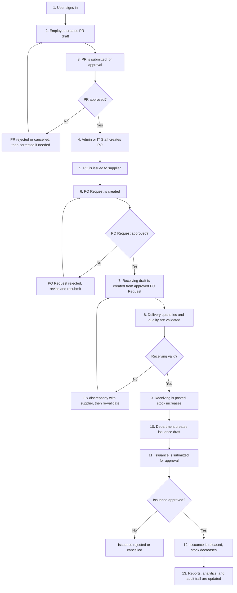

# InventoryV2 Pharmacy System - Workflow and Flowcharts (Non-Technical Guide)

## Purpose of This Document
This guide explains how the pharmacy workflow runs from request to release in plain language.
It is written for managers, operations staff, and stakeholders who need process clarity without code-level details.

## Scope
This document reflects the current live workflow in InventoryV2:
- Procurement: Purchase Request (PR) -> approval -> Purchase Order (PO) -> PO Request (POR)
- Receiving: draft -> validation -> posted inventory
- Issuance: request -> approval -> stock release
- Visibility: reports, analytics, and audit logs

---

## 1) Big Picture: End-to-End Workflow

### What this means
- Stock is added only through posted receiving.
- Stock is deducted only through released issuance.
- Approval gates exist before purchasing and before release.
- Every important step is recorded for traceability.

---

## 2) People Involved and Responsibilities

| Role | Main Responsibilities |
|------|------------------------|
| Admin | Manages users/roles, approves operational requests, oversees procurement/receiving/issuance, monitors reports |
| IT Staff | Performs operational workflow actions (approvals, receiving, reporting, analytics) but does not manage admin users/roles |
| Employee | Creates and submits purchase and issuance requests, tracks status, follows correction feedback |

### Simple role summary
- **Admin:** Full control, including user-role administration.
- **IT Staff:** Operational controller for day-to-day flow.
- **Employee:** Request creator and requester of stock.

---

## 3) Step-by-Step Process With Explanations

### Step 1 - Sign in and access control
**Goal:** Ensure only authorized users can perform actions.
- User logs in.
- System checks role and routes user to the correct pages.

**Why this matters:** Prevents unauthorized actions and protects data.

### Step 2 - Create and submit Purchase Request (PR)
**Goal:** Formally request needed items.
- Employee creates PR draft with line items.
- Employee submits PR for approval.

**Why this matters:** Establishes a controlled demand record before spending.

### Step 3 - Approve or reject PR
**Goal:** Validate necessity and correctness before procurement.
- Admin or IT Staff reviews request details.
- If approved, PR can move to PO creation.
- If rejected, requester corrects and resubmits (or cancels).

**Why this matters:** Prevents incorrect or unnecessary purchasing.

### Step 4 - Create and issue Purchase Order (PO)
**Goal:** Convert approved PR into supplier-facing order.
- PO is generated from approved PR.
- PO is issued to supplier.

**Why this matters:** Creates the formal document used for supplier fulfillment.

### Step 5 - Create and approve PO Request (POR)
**Goal:** Control receiving conversion before stock intake.
- Operational user creates POR from an issued PO.
- POR is approved before receiving is allowed.

**Why this matters:** Adds a second control gate between ordering and receiving.

### Step 6 - Create receiving draft and validate delivery
**Goal:** Check what arrived against what was ordered.
- Receiving draft is generated from approved POR.
- Team enters received, accepted, and rejected quantities.
- Validation ensures totals and limits are correct.

**Why this matters:** Blocks incorrect quantities from entering inventory.

### Step 7 - Post receiving to inventory
**Goal:** Increase stock only after valid receiving.
- System posts accepted quantities.
- Inventory balances and inbound stock movements are updated.

**Why this matters:** Keeps on-hand and available stock accurate.

### Step 8 - Create and submit issuance request
**Goal:** Request stock release to departments in a controlled way.
- Requester creates issuance draft with needed quantities.
- Draft is submitted for approval.

**Why this matters:** Prevents informal stock withdrawal.

### Step 9 - Approve or reject issuance
**Goal:** Ensure release is authorized and justified.
- Admin or IT Staff approves or rejects submitted issuance.
- Rejected requests can be corrected and resubmitted.

**Why this matters:** Adds accountability before stock leaves inventory.

### Step 10 - Release issuance
**Goal:** Deduct stock and complete fulfillment.
- Approved issuance is released.
- System deducts stock and logs outbound movements.

**Why this matters:** Maintains accurate consumption history.

### Step 11 - Reporting, analytics, and audit logging
**Goal:** Provide visibility and compliance evidence.
- Reports reflect stock and movement outcomes.
- Analytics captures usage trends.
- Audit trail records who changed what and when.

**Why this matters:** Supports monitoring, compliance, and investigations.

---

## 4) Status Lifecycle Reference (Simplified)

Use this section to interpret status labels seen on screens.

### Purchase Request (PR)
`draft -> submitted -> approved -> converted_to_po`
Alternative exits: `submitted -> rejected`, `draft/submitted -> cancelled`

### Purchase Order (PO)
`draft -> issued -> partially_received/fully_received`

### PO Request (POR)
`pending -> approved -> converted_to_receiving`
Alternative exit: `pending -> rejected`

### Receiving
`draft -> posted`
Alternative exit: `draft -> voided`

### Issuance
`draft -> submitted -> approved -> released`
Alternative exits: `submitted -> rejected`, `draft/submitted -> cancelled`

---

## 5) Common Decision Points and What Happens Next

### If PR is rejected
- Requester receives feedback.
- Request is corrected and resubmitted, or cancelled.

### If PO Request is rejected
- Operational team adjusts details.
- POR is resubmitted for approval.

### If delivery quantities do not match
- Receiving stays unposted.
- Team resolves discrepancy with supplier.
- Only validated accepted quantities are posted.

### If stock is insufficient at issuance release
- Release is blocked.
- Issuance stays in controllable state until quantities are adjusted or replenished.

---

## 6) End-to-End Example (Single Scenario)

```mermaid
graph LR
    A[Department needs medicine] --> B[PR draft created and submitted]
    B --> C[PR approved]
    C --> D[PO created and issued]
    D --> E[POR created and approved]
    E --> F[Receiving draft validated]
    F --> G[Receiving posted to inventory]
    G --> H[Issuance draft submitted]
    H --> I[Issuance approved]
    I --> J[Issuance released and stock deducted]
    J --> K[Reports and audit records updated]
```

### Example in one sentence
A department requests medicine, procurement is approved and ordered, delivery is validated and posted to stock, then authorized issuance releases items with full reporting and audit history.

---

## 7) Quick Glossary (Non-Technical)
- **Purchase Request (PR):** Internal request to buy items.
- **Purchase Order (PO):** Official order sent to supplier.
- **PO Request (POR):** Operational control record required before receiving conversion.
- **Receiving:** Validation and posting of delivered items.
- **Issuance:** Releasing stock to a requesting unit.
- **Audit Trail:** History of significant user actions and status changes.

---

## Document Info
- **Audience:** Non-technical users, managers, operations teams, and stakeholders
- **Scope:** Full InventoryV2 pharmacy workflow (request to release)
- **Version:** 1.1
- **Last Updated:** 2026-03-05
