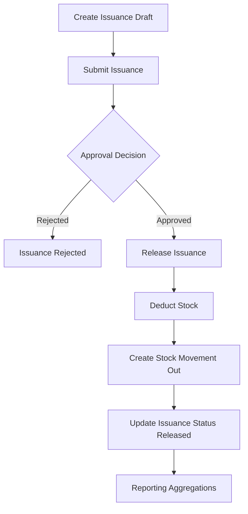

# InventoryV2 Pharmacy System - Issuance + Reporting Module Architecture

## Module Overview
The Issuance + Reporting Module manages controlled stock release and provides operational analytics for stock balances, movement trends, and low-stock monitoring. It is the final operational stage after procurement and receiving.

## Objectives
- Implement secure issuance request and release workflow
- Enforce stock availability and approval checks before release
- Record complete outbound movement history
- Provide actionable reports for pharmacy operations
- Ensure auditable and testable issuance behavior

## Scope

### Included
- Issuance draft, submission, approval, and release
- Issuance line validations against available stock
- Stock deduction and movement logging
- Daily/monthly stock and movement reports
- Low-stock and fast-moving item analytics

### Excluded
- Procurement and receiving creation flows
- External BI tools and third-party reporting integrations
- Advanced demand forecasting models (future phase)

---

## Workflow Design

### Primary Flow
`Issuance Draft -> Approval -> Release -> Stock Update -> Reports`



### Issuance Status Rules
- `draft -> submitted`
- `submitted -> approved | cancelled`
- `approved -> released`
- `submitted -> rejected` (through approval workflow table or explicit status policy)

Only `approved` issuance records can be released.

---

## Module Architecture

### Backend Flow
`IssuanceController -> IssuanceService -> IssuanceRepository -> Models -> MySQL`

`ReportingController -> ReportingService -> ReportingRepository -> MySQL`

### Key Components
- **Controllers**
  - `IssuanceController`
  - `IssuanceApprovalController`
  - `ReportingController`
- **Services**
  - `IssuanceService`
  - `IssuanceApprovalService`
  - `IssuanceReleaseService`
  - `InventoryAvailabilityService`
  - `ReportingService`
- **Repositories**
  - `IssuanceRepository`
  - `IssuanceItemRepository`
  - `InventoryStockRepository`
  - `StockMovementRepository`
  - `ReportingRepository`
- **Actions**
  - `ReserveStockForIssuanceAction`
  - `ReleaseIssuanceAction`
  - `BuildStockSummaryReportAction`

---

## Folder Structure (Module-Specific)
```text
app/
├── Controllers/Inventory/
│   ├── IssuanceController.php
│   ├── IssuanceApprovalController.php
│   └── ReportingController.php
├── Services/Inventory/
│   ├── IssuanceService.php
│   ├── IssuanceApprovalService.php
│   ├── IssuanceReleaseService.php
│   ├── InventoryAvailabilityService.php
│   └── ReportingService.php
├── Repositories/Contracts/Inventory/
│   ├── IssuanceRepositoryInterface.php
│   ├── IssuanceItemRepositoryInterface.php
│   ├── InventoryStockRepositoryInterface.php
│   ├── StockMovementRepositoryInterface.php
│   └── ReportingRepositoryInterface.php
├── Repositories/EloquentLike/Inventory/
│   ├── IssuanceRepository.php
│   ├── IssuanceItemRepository.php
│   ├── InventoryStockRepository.php
│   ├── StockMovementRepository.php
│   └── ReportingRepository.php
└── Views/inventory/
    ├── issuance/
    └── reports/
```

---

## Database Entities

### Primary Tables
- `issuances`
- `issuance_items`
- `inventory_stocks`
- `stock_movements`
- `approvals`

### Supporting Tables
- `products`
- `users`
- `units`
- `audit_logs`

---

## Issuance and Stock Rules

### Availability Rules
- `issued_qty` must be `> 0`
- `issued_qty <= available_qty` for selected stock key
- Controlled products can require admin or dual-approval policy
- Release is blocked when stock is insufficient

### Stock Deduction Rules
- On release, deduct from `inventory_stocks.on_hand_qty` and recalculate `available_qty`
- Create `stock_movements` row with `movement_type = issuance`
- Link movement reference to issuance record for traceability
- Prevent duplicate release posting via idempotent status checks

### Allocation Strategy
- Default allocation can use FEFO (`expiry_date` ascending) where enabled
- Manual batch selection allowed for override users with permission
- Allocation decisions are logged to `audit_logs`

---

## Reporting Strategy

### Core Reports
1. **Stock Balance Report**
   - By product, category, batch, and expiry
2. **Stock Movement Report**
   - Inbound/outbound per date range
3. **Issuance Report**
   - By requestor, department, and status
4. **Low Stock Report**
   - Products below reorder levels
5. **Fast-Moving Items Report**
   - Consumption trend by period

### Reporting Data Sources
- `inventory_stocks` for current balances
- `stock_movements` for transactional history
- `issuances` and `issuance_items` for release details
- `products` and `product_categories` for dimensions

---

## Route Plan

### Issuance
- `GET /inventory/issuance`
- `GET /inventory/issuance/create`
- `POST /inventory/issuance`
- `POST /inventory/issuance/{id}/submit`
- `POST /inventory/issuance/{id}/approve`
- `POST /inventory/issuance/{id}/reject`
- `POST /inventory/issuance/{id}/release`
- `POST /inventory/issuance/{id}/cancel`

### Reports
- `GET /reports/stock-balance`
- `GET /reports/stock-movements`
- `GET /reports/issuances`
- `GET /reports/low-stock`
- `GET /reports/fast-moving`

---

## Validation Rules

### Issuance Header
- `requestor_id`: required, exists
- `issue_date`: required, valid date
- `department`: optional, max length

### Issuance Items
- `items`: required, min 1
- `items.*.product_id`: required, exists
- `items.*.unit_id`: required, exists
- `items.*.requested_qty`: required, decimal, `> 0`
- `items.*.issued_qty`: required on release, decimal, `> 0`

### Release Guard Rules
- Issuance status must be `approved`
- All line items must have valid inventory allocation
- Stock checks must pass before transaction commit

---

## Security & Permission Matrix

| Operation | Admin | Employee | IT dev/staff |
|-----------|-------|----------|--------------|
| Create Issuance | ✅ | ✅ (if granted) | ✅ |
| Submit Issuance | ✅ | ✅ (own requests) | ✅ |
| Approve Issuance | ✅ | ❌ | ✅ (if granted) |
| Release Issuance | ✅ | ❌ | ✅ (if granted) |
| View Reports | ✅ | Limited | ✅ |
| View Audit Logs | ✅ | ❌ | ✅ (if granted) |

---

## Transaction Management

### Release Transaction Boundary
1. Lock issuance row and related stock rows
2. Validate status and stock availability
3. Deduct stock quantities
4. Insert outbound stock movement rows
5. Update issuance and line statuses/quantities
6. Insert audit log entries

Any failure rolls back the entire release transaction.

---

## Testing Strategy

### Unit Tests
- Availability checks for each issuance line
- FEFO allocation ordering logic
- Status transition and duplicate release prevention
- Report aggregation query builders

### Integration Tests
- Create->submit->approve->release happy path
- Rejected issuance behavior
- Insufficient stock failure path
- Role-based permission enforcement on approve/release

### Reporting Tests
- Date range filters and groupings
- Low-stock threshold detection
- Consistency between movement totals and stock balances

---

## Implementation Checklist

### Phase I1: Issuance Core
- [x] Implement issuance create/edit/submit endpoints
- [x] Add issuance item forms and validation
- [x] Add approval integration and status transitions

### Phase I2: Release Engine
- [x] Implement inventory availability service
- [x] Implement release transaction and stock deduction
- [x] Add outbound stock movement logging

### Phase I3: Reporting
- [x] Implement stock balance and movement reports
- [x] Implement low-stock and fast-moving reports
- [x] Add filtering and export-ready response structure

### Phase I4: Hardening
- [x] Add full integration tests for release failures
- [x] Add audit coverage checks
- [x] Add performance checks for high-volume report queries

---

## Definition of Done
- Issuance lifecycle works from draft to release with controls
- Stock deductions and movement logs are consistent and auditable
- Unauthorized users cannot approve/release issuance
- Core operational reports return accurate filtered data
- Unit and integration tests pass for issuance and reporting workflows

---

**Document Version:** 1.1  
**Last Updated:** 2026-02-20  
**Related Documents:**
- [Architectural Plan](Architectural Plan.md)
- [Complete Database Schema](PHARMACY_DATABASE_SCHEMA.md)
- [Receiving + Inventory Module](RECEIVING_INVENTORY_MODULE_ARCHITECTURE.md)

