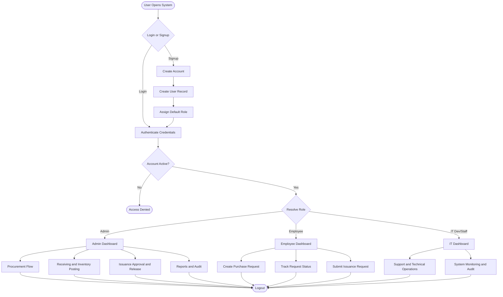
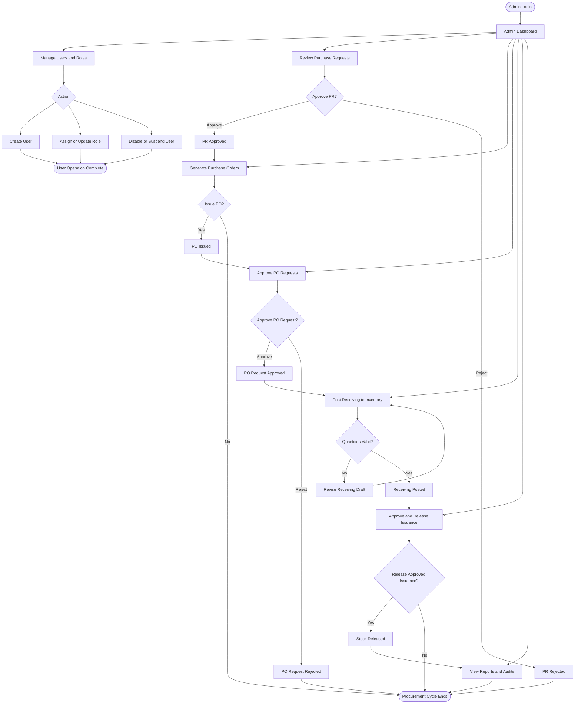
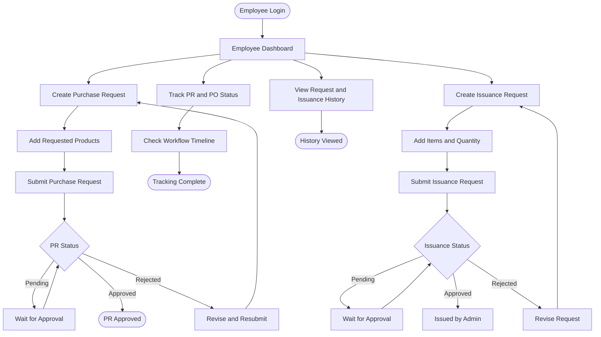
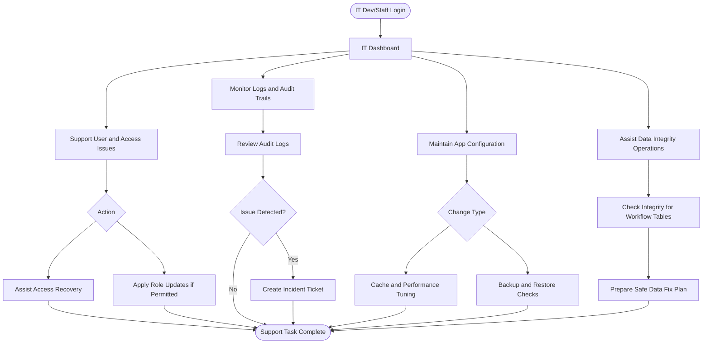
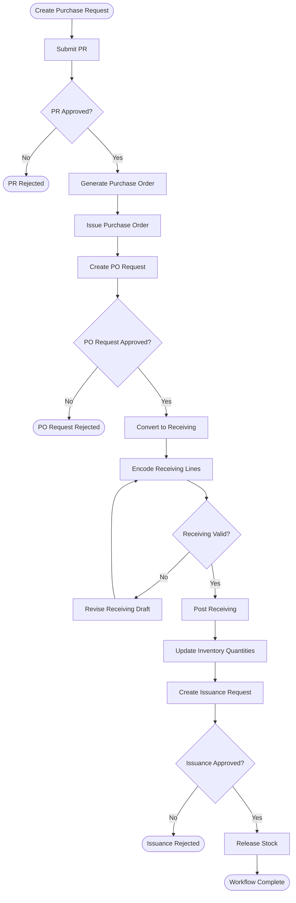
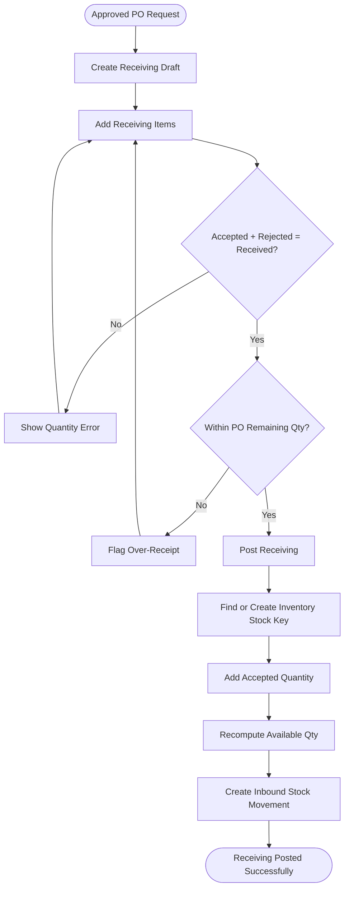
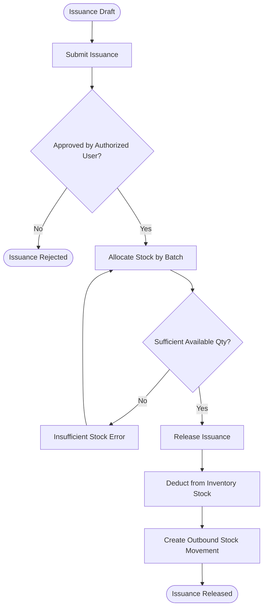

# InventoryV2 Pharmacy System - User Workflow Flowchart

## Overview
This document provides workflow flowcharts for all user roles in the InventoryV2 Pharmacy System. It shows how users interact with procurement, receiving, inventory quantity posting, and issuance modules from login to final transaction completion.

## User Roles
1. **Admin** - Full access across authentication, procurement, receiving, inventory, issuance, and reporting
2. **Employee** - Creates purchase requests, tracks statuses, and submits issuance requests based on permissions
3. **IT Dev/Staff** - Technical support and controlled operational actions based on assigned permissions

---

## Complete System Workflow

---

## Admin User Workflow

---

## Employee Workflow

---

## IT Dev/Staff Workflow

---

## Purchase Request to Issuance End-to-End Workflow

---

## Receiving Conversion and Inventory Posting Workflow

---

## Issuance Approval and Release Workflow

---

## System Access Control Matrix

| Module | Admin | Employee | IT Dev/Staff |
|--------|-------|----------|--------------|
| Authentication & User Management | Full Access | Own Account | Limited Admin (if granted) |
| Procurement (PR/Approval/PO/POR) | Full Access | Create/Track PR | Operational Support (if granted) |
| Receiving Conversion | Full Access | No Direct Posting | Operational Support (if granted) |
| Inventory Quantity Management | Full Access | View Limited | Operational Support |
| Issuance Approval/Release | Full Access | Submit Requests | Operational Support (if granted) |
| Reports & Audit Logs | Full Access | Limited Own/Department Views | Technical and Audit Views |

---

## Key Workflow Notes

### Authentication and Authorization
- All routes require authenticated sessions except login/signup
- Role filters and permission checks enforce operation boundaries
- Unauthorized access attempts are logged to audit records

### Data Flow
- Procurement creates transaction intent (`PR -> PO -> PO Request`)
- Receiving converts approved requests into stock entries
- Inventory tables hold current balances and movement history
- Issuance consumes stock and writes outbound movements

### Approval Controls
- PR approval is required before PO generation
- PO request approval is required before receiving conversion
- Issuance approval is required before stock release
- Invalid state transitions are blocked by service-layer rules

### Notifications and Tracking
- Users track statuses via dashboard and module timelines
- Approval/rejection actions create audit entries
- Operational exceptions are visible in logs and report views

---

**Document Version:** 1.0  
**Last Updated:** 2026-02-19  
**Related Documents:**
- [Architectural Plan](Architectural Plan.md)
- [Architecture Reference](Architecture.md)
- [Complete Database Schema](PHARMACY_DATABASE_SCHEMA.md)
- [Auth/RBAC Module](AUTH_RBAC_MODULE_ARCHITECTURE.md)
- [Procurement Module](PROCUREMENT_MODULE_ARCHITECTURE.md)
- [Receiving + Inventory Module](RECEIVING_INVENTORY_MODULE_ARCHITECTURE.md)
- [Issuance + Reporting Module](ISSUANCE_REPORTING_MODULE_ARCHITECTURE.md)
