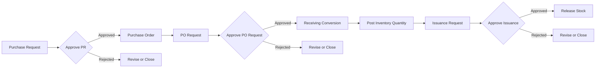

# InventoryV2 Pharmacy System - Workflow Summary (Condensed)

## Purpose
This document is a simplified, stakeholder-friendly view of the InventoryV2 Pharmacy System workflow. It shows who does what, where approvals happen, and how inventory moves from request to issuance.

## Roles (At a Glance)
- **Admin**: Oversees approvals, receiving posting, stock release, and reports
- **Employee**: Creates purchase requests and issuance requests
- **IT Dev/Staff**: Supports access, system operations, and audit visibility

---

## End-to-End Workflow (Condensed)

---

## Role-Based Workflow Snapshot

### Employee
1. Creates purchase request
2. Tracks approval status
3. Submits issuance request when stock is needed

### Admin
1. Approves/rejects PR and PO Request
2. Posts receiving to inventory
3. Approves and releases issuance
4. Reviews reports and audit logs

### IT Dev/Staff
1. Maintains user access and role mappings (if permitted)
2. Monitors logs and operational integrity
3. Supports technical troubleshooting

---

## Critical Approval Gates
- **Gate 1:** PR must be approved before PO generation
- **Gate 2:** PO Request must be approved before receiving conversion
- **Gate 3:** Issuance must be approved before stock release

If any gate is rejected, the request returns for revision or closure.

---

## Core Controls
- Role-based access per module and action
- Service-layer validation for all status transitions
- Transaction-safe stock posting and stock release
- Audit logging for approval, posting, and release actions

---

## Main Outputs
- Approved procurement documents (PR/PO/PO Request)
- Posted receiving transactions
- Updated inventory balances
- Issuance release records
- Operational and audit reports

---

## Related Documents
- [Architectural Plan](Architectural Plan.md)
- [System Workflow Flowchart (Detailed)](PHARMACY_SYSTEM_WORKFLOW_FLOWCHART.md)
- [Complete Database Schema](PHARMACY_DATABASE_SCHEMA.md)
- [Procurement Module](PROCUREMENT_MODULE_ARCHITECTURE.md)
- [Receiving + Inventory Module](RECEIVING_INVENTORY_MODULE_ARCHITECTURE.md)
- [Issuance + Reporting Module](ISSUANCE_REPORTING_MODULE_ARCHITECTURE.md)

---

**Document Version:** 1.0  
**Last Updated:** 2026-02-19
