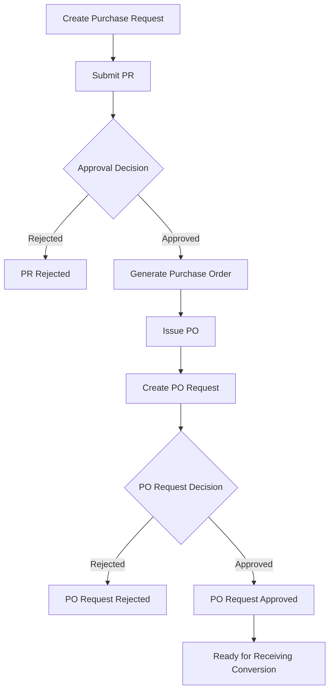

# InventoryV2 Pharmacy System - Procurement Module Architecture

## Module Overview
The Procurement Module manages the controlled purchasing lifecycle for pharmacy inventory. It covers purchase request creation, approval processing, purchase order generation, and PO request management before receiving conversion.

## Objectives
- Standardize `purchase request -> approval -> purchase order -> PO request`
- Enforce strict status transitions and role-based approvals
- Maintain traceability from requested item to ordered item
- Keep controllers thin by delegating all workflow logic to services
- Provide unit and integration tests for transition correctness

## Scope

### Included
- Purchase request creation, editing, submission, cancellation
- Approval workflow (approve/reject with reasons)
- Purchase order generation from approved PR
- PO request creation and lifecycle control
- Procurement audit entries and reporting hooks

### Excluded
- Physical receiving of goods
- Stock quantity posting
- Issuance to departments/users

---

## Workflow Design

### Primary Flow
`Purchase Request -> Approval -> Purchase Order -> PO Request`



### Status Transition Rules

#### Purchase Request (`purchase_requests.status`)
- `draft -> submitted`
- `submitted -> approved | rejected`
- `draft | submitted -> cancelled`
- `approved -> converted_to_po`

#### Purchase Order (`purchase_orders.status`)
- `draft -> issued`
- `issued -> partially_received | fully_received`
- `draft | issued -> cancelled`

#### PO Request (`po_requests.status`)
- `pending -> approved | rejected`
- `approved -> converted_to_receiving`
- `converted_to_receiving -> closed`

Invalid transitions must throw domain exceptions and never partially update records.

---

## Module Architecture

### Backend Flow
`ProcurementController -> ProcurementService -> ProcurementRepository -> Models -> MySQL`

### Key Components
- **Controllers**
  - `PurchaseRequestController`
  - `PurchaseApprovalController`
  - `PurchaseOrderController`
  - `PoRequestController`
- **Services**
  - `PurchaseRequestService`
  - `ApprovalService`
  - `PurchaseOrderService`
  - `PoRequestService`
- **Repositories**
  - `PurchaseRequestRepository`
  - `ApprovalRepository`
  - `PurchaseOrderRepository`
  - `PoRequestRepository`
- **Actions**
  - `GeneratePoNumberAction`
  - `ConvertApprovedPrToPoAction`
  - `CreatePoRequestAction`

---

## Folder Structure (Module-Specific)
```text
app/
├── Controllers/Procurement/
│   ├── PurchaseRequestController.php
│   ├── PurchaseApprovalController.php
│   ├── PurchaseOrderController.php
│   └── PoRequestController.php
├── Services/Procurement/
│   ├── PurchaseRequestService.php
│   ├── ApprovalService.php
│   ├── PurchaseOrderService.php
│   └── PoRequestService.php
├── Repositories/Contracts/Procurement/
│   ├── PurchaseRequestRepositoryInterface.php
│   ├── ApprovalRepositoryInterface.php
│   ├── PurchaseOrderRepositoryInterface.php
│   └── PoRequestRepositoryInterface.php
├── Repositories/EloquentLike/Procurement/
│   ├── PurchaseRequestRepository.php
│   ├── ApprovalRepository.php
│   ├── PurchaseOrderRepository.php
│   └── PoRequestRepository.php
└── Views/procurement/
    ├── purchase_requests/
    ├── approvals/
    ├── purchase_orders/
    └── po_requests/
```

---

## Database Entities

### Primary Tables
- `purchase_requests`
- `purchase_request_items`
- `approvals`
- `purchase_orders`
- `purchase_order_items`
- `po_requests`

### Supporting Tables
- `users`
- `suppliers`
- `products`
- `units`
- `audit_logs`

---

## Service Responsibilities

### PurchaseRequestService
- Create PR header and item rows
- Validate item quantities and duplicates
- Handle draft updates and submission
- Enforce cancel rules for non-finalized PRs

### ApprovalService
- Assign and resolve approval records
- Validate approver role/permission
- Record approval or rejection reason
- Trigger downstream PO eligibility

### PurchaseOrderService
- Convert approved PR items into PO items
- Compute monetary totals and pricing fields
- Mark PO issuance and update status
- Prevent duplicate conversion from same PR

### PoRequestService
- Create PO request from issued PO
- Enforce approval gates before receiving conversion
- Handle rejection, closure, and conversion states

---

## Repository Query Strategy

### Read Patterns
- List PRs by `status`, `request_date`, `requested_by`
- List pending approvals per approver and module
- List open POs by supplier and date range
- List PO requests pending conversion

### Write Patterns
- Use transactions for:
  - PR submit + approval row creation
  - PR approve + PO generation
  - PO request approve + transition updates

### Index Usage
- Status/date indexes on all operational tables
- Composite lookup for approval references
- Unique keys on transaction numbers (`pr_number`, `po_number`, `po_request_number`)

---

## Route Plan

### Purchase Requests
- `GET /procurement/purchase-requests`
- `GET /procurement/purchase-requests/create`
- `POST /procurement/purchase-requests`
- `POST /procurement/purchase-requests/{id}/submit`
- `POST /procurement/purchase-requests/{id}/cancel`

### Approvals
- `GET /procurement/approvals/pending`
- `POST /procurement/approvals/{id}/approve`
- `POST /procurement/approvals/{id}/reject`

### Purchase Orders
- `GET /procurement/purchase-orders`
- `POST /procurement/purchase-orders/from-pr/{prId}`
- `POST /procurement/purchase-orders/{id}/issue`

### PO Requests
- `GET /procurement/po-requests`
- `POST /procurement/po-requests/from-po/{poId}`
- `POST /procurement/po-requests/{id}/approve`
- `POST /procurement/po-requests/{id}/reject`

---

## Validation Rules

### Purchase Request
- `request_date`: required, valid date
- `items`: required, min 1
- `items.*.product_id`: required, exists
- `items.*.requested_qty`: required, decimal, `> 0`
- `items.*.unit_id`: required, exists

### Approval
- `decision`: required, enum (`approved`, `rejected`)
- `comments`: required when decision is `rejected`

### Purchase Order
- `supplier_id`: required, exists, active
- `order_date`: required, valid date
- `items.*.unit_cost`: required, decimal, `>= 0`

### PO Request
- `request_date`: required
- `purchase_order_id`: required, exists, status must be `issued`

---

## Security & Permission Matrix

| Operation | Admin | Employee | IT dev/staff |
|-----------|-------|----------|--------------|
| Create PR | ✅ | ✅ | ✅ |
| Submit PR | ✅ | ✅ | ✅ |
| Approve PR | ✅ | ❌ | ✅ (if granted) |
| Generate PO | ✅ | ❌ | ✅ (if granted) |
| Approve PO Request | ✅ | ❌ | ✅ (if granted) |
| Cancel PR/PO | ✅ | Limited (own draft PR) | ✅ (if granted) |

---

## Testing Strategy

### Unit Tests
- PR status transition enforcement
- Approval decision handling and guard checks
- PO total calculations and line mapping logic
- PO request conversion eligibility checks

### Integration Tests
- End-to-end flow from PR submission to approved PO request
- Rejection paths for PR and PO request
- Duplicate conversion prevention (idempotency)
- Permission-based access restrictions by role

### Data Integrity Tests
- Transaction rollback on partial failure
- FK integrity in PR/PO/PO request relationships
- Consistency of item quantities between PR and PO tables

---

## Implementation Checklist

### Phase P1: Purchase Requests
- [ ] Implement PR controllers, services, repositories
- [ ] Add create/edit/submit/cancel screens
- [ ] Add PR item validation and duplicate checks

### Phase P2: Approval Flow
- [ ] Implement approval assignment and decision endpoints
- [ ] Add rejection reason enforcement
- [ ] Add pending approvals dashboard list

### Phase P3: Purchase Orders
- [ ] Implement PR-to-PO conversion action
- [ ] Implement PO item and total computations
- [ ] Add PO issuance transition and guard rules

### Phase P4: PO Requests
- [ ] Implement PO request create/approve/reject flows
- [ ] Enforce readiness rules for receiving conversion
- [ ] Add integration tests for complete procurement lifecycle

---

## Definition of Done
- Procurement lifecycle runs end-to-end up to approved PO request
- Invalid transition attempts are blocked and logged
- Route protection and role checks are enforced
- Audit entries are written for approve/reject/issue/cancel actions
- Unit and integration tests pass for happy and failure paths

---

**Document Version:** 1.0  
**Last Updated:** 2026-02-19  
**Related Documents:**
- [Architectural Plan](Architectural Plan.md)
- [Complete Database Schema](PHARMACY_DATABASE_SCHEMA.md)
- [Receiving + Inventory Module](RECEIVING_INVENTORY_MODULE_ARCHITECTURE.md)
