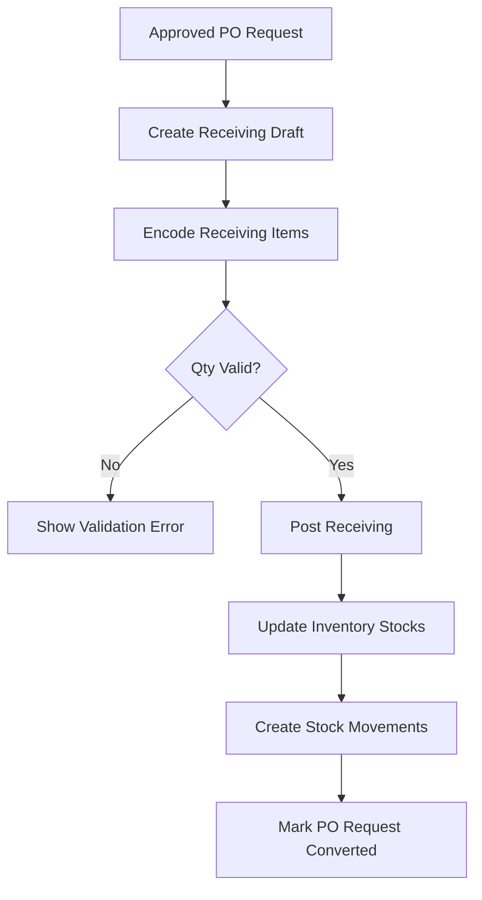

# InventoryV2 Pharmacy System - Receiving + Inventory Quantity Module Architecture

## Module Overview
The Receiving + Inventory Quantity Module converts approved PO requests into receiving transactions, validates delivered quantities, and posts accepted quantities into inventory stocks with auditable stock movement records.

## Objectives
- Enforce controlled conversion from approved PO request to receiving
- Validate received, accepted, and rejected quantities
- Support batch/lot/expiry capture for pharmacy items
- Keep stock ledger and movement history consistent
- Provide reconciliation tooling and test coverage for quantity accuracy

## Scope

### Included
- Receiving header/detail creation from PO request
- Quantity validation and posting logic
- Batch/lot/expiry recording
- Inventory stock update (on-hand/available/reserved)
- Stock movement logging for all intake operations

### Excluded
- Procurement approvals and PO generation
- Final issuance approval/release operations
- External warehouse integrations

---

## Workflow Design

### Primary Flow
`Approved PO Request -> Receiving Conversion -> Quantity Validation -> Stock Posting`



### Receiving Status Rules
- `draft -> posted`
- `draft -> voided`

### PO Request Status Interaction
- Only `po_requests.status = approved` can be converted
- On successful posting, `po_requests.status -> converted_to_receiving`
- Subsequent receiving operations follow PO partial/full receive rules

---

## Module Architecture

### Backend Flow
`ReceivingController -> ReceivingService -> ReceivingRepository -> Models -> MySQL`

`InventoryPostingService -> InventoryRepository -> inventory_stocks + stock_movements`

### Key Components
- **Controllers**
  - `ReceivingController`
  - `ReceivingValidationController`
  - `InventoryQuantityController`
- **Services**
  - `ReceivingService`
  - `ReceivingValidationService`
  - `InventoryPostingService`
  - `StockMovementService`
- **Repositories**
  - `ReceivingRepository`
  - `ReceivingItemRepository`
  - `InventoryStockRepository`
  - `StockMovementRepository`
- **Actions**
  - `ConvertPoRequestToReceivingAction`
  - `PostReceivingToInventoryAction`
  - `RecalculateAvailableQtyAction`

---

## Folder Structure (Module-Specific)
```text
app/
├── Controllers/Receiving/
│   ├── ReceivingController.php
│   ├── ReceivingValidationController.php
│   └── InventoryQuantityController.php
├── Services/Receiving/
│   ├── ReceivingService.php
│   ├── ReceivingValidationService.php
│   ├── InventoryPostingService.php
│   └── StockMovementService.php
├── Repositories/Contracts/Receiving/
│   ├── ReceivingRepositoryInterface.php
│   ├── ReceivingItemRepositoryInterface.php
│   ├── InventoryStockRepositoryInterface.php
│   └── StockMovementRepositoryInterface.php
├── Repositories/EloquentLike/Receiving/
│   ├── ReceivingRepository.php
│   ├── ReceivingItemRepository.php
│   ├── InventoryStockRepository.php
│   └── StockMovementRepository.php
└── Views/receiving/
    ├── index.php
    ├── create.php
    ├── show.php
    └── conversion.php
```

---

## Database Entities

### Primary Tables
- `po_requests`
- `receivings`
- `receiving_items`
- `inventory_stocks`
- `stock_movements`

### Supporting Tables
- `purchase_orders`
- `purchase_order_items`
- `products`
- `units`
- `users`
- `audit_logs`

---

## Quantity and Posting Rules

### Receiving Item Validation
- `received_qty > 0`
- `accepted_qty >= 0`
- `rejected_qty >= 0`
- `accepted_qty + rejected_qty = received_qty`
- Total accepted quantity must not exceed remaining PO item quantity unless override policy is enabled

### Stock Posting Rules
- Posted receiving writes stock increments (`qty_in`) only for accepted quantities
- Rejected quantities are tracked but do not increase stock
- Inventory key is matched by: `product_id + batch_no + lot_no + expiry_date + unit_id`
- `available_qty = on_hand_qty - reserved_qty` recalculated after each posting

### Costing Rules
- `average_unit_cost` updates using weighted average when new stock is posted
- Stock movement entry records `unit_cost` for traceability

---

## Reconciliation Strategy

### Automated Checks
- Compare PO ordered vs received totals by line
- Flag over-receipt and under-receipt conditions
- Detect expiry date anomalies (expired or near-expiry based on policy)
- Detect missing batch/lot where tracking is required

### Manual Reconciliation
- Draft receiving can be revised before posting
- Posted receiving corrections require adjustment entries, not direct edits
- All reconciliation actions are written to `audit_logs`

---

## Route Plan

### Receiving
- `GET /receiving`
- `GET /receiving/create/from-po-request/{poRequestId}`
- `POST /receiving`
- `GET /receiving/{id}`
- `POST /receiving/{id}/post`
- `POST /receiving/{id}/void`

### Quantity Validation / Utilities
- `POST /receiving/{id}/validate`
- `GET /inventory/quantities`
- `GET /inventory/quantities/{productId}`

---

## Validation Rules

### Receiving Header
- `po_request_id`: required, exists, status must be `approved`
- `supplier_id`: required, exists
- `received_date`: required, valid date
- `received_by`: required, exists

### Receiving Items
- `items`: required, min 1
- `items.*.purchase_order_item_id`: required, exists
- `items.*.product_id`: required, exists
- `items.*.unit_id`: required, exists
- `items.*.received_qty`: required, decimal, `> 0`
- `items.*.accepted_qty`: required, decimal, `>= 0`
- `items.*.rejected_qty`: required, decimal, `>= 0`
- `items.*.expiry_date`: required when product requires expiry tracking

---

## Security & Permission Matrix

| Operation | Admin | Employee | IT dev/staff |
|-----------|-------|----------|--------------|
| View Receiving Records | ✅ | ❌ | ✅ (read-only) |
| Create Receiving Draft | ✅ | ❌ | ❌ |
| Validate Receiving | ✅ | ❌ | ❌ |
| Post Receiving | ✅ | ❌ | ❌ |
| Void Receiving | ✅ | ❌ | ❌ |
| View Inventory Quantities | ✅ | ✅ (limited) | ✅ |

**Note:** IT Staff role is now focused on technical support. They can view receiving records and inventory quantities for troubleshooting purposes, but cannot create, post, or void receiving transactions.

---

## Transaction Management

### Posting Transaction Boundary
Single DB transaction per receiving post:
1. Lock related PO request and receiving rows
2. Validate quantities and statuses
3. Insert/update `inventory_stocks`
4. Insert `stock_movements`
5. Update receiving status and timestamps
6. Update PO/PO request status where needed
7. Write audit entries

If any step fails, rollback entire transaction.

---

## Testing Strategy

### Unit Tests
- Quantity validation rules (`accepted + rejected = received`)
- Stock posting and `available_qty` recalculation
- Weighted average cost calculations
- Status transition guard logic

### Integration Tests
- Convert approved PO request into receiving draft
- Post receiving and verify stock movement rows
- Partial receiving and repeated receipts behavior
- Attempt invalid conversion from non-approved PO request

### Data Integrity Tests
- No duplicate stock keys for same product batch/lot/expiry/unit
- Movement balances align with stock table values
- Foreign key integrity from receiving to PO artifacts

---

## Implementation Checklist

### Phase R1: Conversion and Draft
- [x] Implement PO request to receiving conversion action
- [x] Build receiving create/show interfaces
- [x] Load PO item defaults into receiving lines

### Phase R2: Validation and Posting
- [x] Implement receiving line validation service
- [x] Implement inventory posting transaction
- [x] Create stock movement logging for posted lines

### Phase R3: Reconciliation
- [x] Add mismatch and over-receipt checks
- [x] Add receiving void rules and safeguards
- [x] Add audit logging for all posting/void actions

### Phase R4: Testing
- [x] Add unit tests for quantity validation logic
- [x] Add unit tests for cost and weighted-average posting logic
- [x] Add integration tests for conversion/posting paths
- [x] Add rollback tests for forced posting failures

---

## Definition of Done
- Receiving conversion works only from approved PO requests
- Posting updates stock balances and movement logs correctly
- Batch/lot/expiry data is persisted where required
- Invalid quantity and status combinations are blocked
- Tests pass for posting, reconciliation, and failure scenarios

---

**Document Version:** 1.1  
**Last Updated:** 2026-02-20  
**Related Documents:**
- [Architectural Plan](Architectural Plan.md)
- [Complete Database Schema](PHARMACY_DATABASE_SCHEMA.md)
- [Procurement Module](PROCUREMENT_MODULE_ARCHITECTURE.md)
- [Issuance + Reporting Module](ISSUANCE_REPORTING_MODULE_ARCHITECTURE.md)


